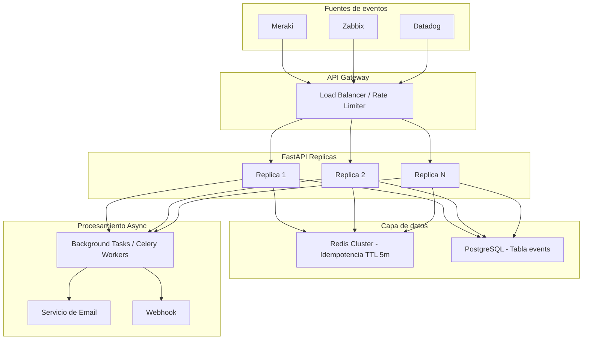

# HTQA Event Monitoring Microservice

Microservicio backend para HTQA S.A.S. orientado a eventos de monitoreo de infraestructura tecnológica. Ingesta eventos de múltiples fuentes (Meraki, Zabbix, Datadog, etc.), clasifica severidad mediante reglas desacopladas, previene duplicados con idempotencia en ventana de 5 minutos y despacha notificaciones de forma asíncrona.

---

## Tabla de contenidos

1. [Arquitectura del proyecto](#arquitectura-del-proyecto)
2. [Quick Start](#quick-start)
3. [API Reference](#api-reference)
4. [4.1 Endpoint POST /events](#41-endpoint-post-events)
5. [4.2 Idempotencia](#42-idempotencia)
6. [4.3 Clasificación de severidad](#43-clasificación-de-severidad)
7. [4.4 Procesamiento asíncrono](#44-procesamiento-asíncrono)
8. [5. Principios SOLID](#5-principios-solid)
9. [6. Seguridad](#6-seguridad)
10. [7. Revisión de código](#7-revisión-de-código)
11. [8. Arquitectura de despliegue](#8-arquitectura-de-despliegue)
12. [9. SQL](#9-sql)
13. [Tests](#tests)

---

## Arquitectura del proyecto

El proyecto sigue **Clean Architecture** con cuatro capas bien delimitadas:

```
src/
  domain/                    # Reglas de negocio (sin dependencias de frameworks)
    entities/event.py        # Entidad Event + value objects
    enums/                   # SeverityLevel, EventStatus
    interfaces/              # Puertos abstractos (repository, notifier, idempotency store)
    rules/                   # Motor de reglas de severidad (Strategy pattern)

  application/               # Casos de uso / orquestación
    services/event_service.py  # Orquesta: idempotencia → clasificar → persistir → notificar
    dtos/event_dto.py        # Schemas Pydantic (request/response)

  infrastructure/            # Adaptadores (implementan interfaces del dominio)
    persistence/             # SQLAlchemy models + repository
    cache/                   # Redis y memory idempotency stores
    notifications/           # Email y log notifiers
    security/                # JWT auth, rate limiting

  presentation/              # Capa HTTP
    api/v1/events.py         # Ruta POST /events
    middleware/               # Audit logging, error handler global

  config/                    # Configuración transversal
    settings.py              # Variables de entorno (pydantic-settings)
    dependencies.py          # Inyección de dependencias (FastAPI Depends)
    database.py              # Engine + session factory
    logging_config.py        # Logging JSON estructurado
```

Las capas **domain** y **application** tienen cero dependencias de frameworks o infraestructura. Todas las dependencias externas se inyectan a través de interfaces abstractas.

---

## Quick Start

```bash
python -m venv .venv
source .venv/bin/activate
pip install -r requirements.txt
cp .env.example .env    # Editar valores según necesidad
uvicorn main:app --reload
```

Documentación interactiva disponible en `http://localhost:8000/docs`.

---

## API Reference

### POST /api/v1/events

**Autenticación**: JWT Bearer token o header `X-API-Key`.

**Request body**:
```json
{
  "source": "meraki",
  "customer_id": "cli-001",
  "device_id": "sw-44",
  "event_type": "device_down",
  "occurred_at": "2026-04-05T10:12:00Z",
  "metric_value": 0,
  "metadata": {
    "site": "Bogotá",
    "ip": "10.0.2.15"
  }
}
```

**201 Created**:
```json
{
  "status": "created",
  "event_id": "uuid",
  "severity": "critical",
  "received_at": "2026-04-05T10:12:01Z"
}
```

**200 Duplicate**:
```json
{
  "status": "duplicate",
  "event_id": "uuid-of-existing",
  "message": "Event already processed"
}
```

### GET /health

Retorna `{"status": "healthy"}`. No requiere autenticación.

---

## 4.1 Endpoint POST /events

### Ubicación de la lógica de negocio

La lógica de negocio **no** está en la ruta HTTP. El código sigue una separación estricta:

| Capa | Archivo | Responsabilidad |
|------|---------|-----------------|
| **Presentación** | `presentation/api/v1/events.py` | Solo parsear request HTTP, invocar el servicio y formatear la respuesta |
| **Aplicación** | `application/services/event_service.py` | Orquestar el caso de uso: verificar idempotencia → clasificar severidad → persistir evento → encolar notificación |
| **Dominio** | `domain/rules/severity_classifier.py` | Reglas puras de clasificación de severidad |
| **Infraestructura** | `infrastructure/persistence/`, `infrastructure/cache/` | Implementaciones concretas de acceso a datos y cache |

### Validación de entrada

Se usa **Pydantic** con modelos estrictos en `application/dtos/event_dto.py`:

- `source`: string restringido a fuentes conocidas (`meraki`, `zabbix`, `datadog`, `nagios`, `prtg`)
- `customer_id`: regex `^cli-\d{3,}$`
- `device_id`: string no vacío, máximo 50 caracteres
- `event_type`: restringido a tipos permitidos (`device_down`, `high_latency`, `packet_loss`, etc.)
- `occurred_at`: datetime ISO 8601, no puede estar en el futuro
- `metric_value`: float >= 0
- `metadata`: objeto con campos opcionales `site` e `ip`
- Configuración `extra = "forbid"`: rechaza cualquier campo no declarado

### Manejo de errores

El error handler global en `presentation/middleware/error_handler.py` registra handlers para:

| Error | Código HTTP | Respuesta |
|-------|-------------|-----------|
| `RequestValidationError` | 422 | Detalle de campos inválidos |
| `DuplicateEventError` | 200 | `{"status": "duplicate", ...}` |
| `IntegrityError` (DB) | 409 | Conflicto por constraint único |
| `Exception` genérica | 500 | Error interno (sin exponer detalles) |

### Logging

- **Formato**: JSON estructurado (configurado en `config/logging_config.py`)
- **Correlation ID**: cada request recibe un UUID que se propaga en logs y se devuelve en header `X-Correlation-ID`
- **IPs enmascaradas**: el último octeto se reemplaza con `***`
- **Eventos clave logueados**: procesamiento de evento, persistencia exitosa, duplicados detectados, fallos de notificación

### Respuesta estructurada

El endpoint diferencia claramente entre evento creado (201) y duplicado (200), con schemas distintos `EventResponse` y `DuplicateEventResponse`.

---

## 4.2 Idempotencia

### Estrategia

Se genera una **clave de idempotencia determinística** mediante SHA-256:

```
key = SHA256(source + ":" + device_id + ":" + event_type + ":" + occurred_at_utc)
```

Esto significa que dos payloads con los mismos cuatro campos producen la misma clave, independientemente de los demás datos.

### Flujo paso a paso

1. Computar la clave de idempotencia del payload entrante
2. Llamar a `IdempotencyStore.check_and_set(key, ttl_seconds=300)`
3. Si la clave ya existe → buscar evento existente en BD → retornar 200 con `status: "duplicate"`
4. Si la clave es nueva → se setea atómicamente con TTL de 5 minutos → continuar a persistir el evento

### Ventana de 5 minutos

El TTL de 300 segundos garantiza que eventos idénticos dentro de una ventana de 5 minutos se detecten como duplicados. Pasada la ventana, un nuevo evento legítimo puede crearse.

### Manejo de concurrencia

- **Redis** (`SET key value NX EX 300`): operación atómica — si dos requests llegan simultáneamente con la misma clave, solo una logra el `SETNX`
- **In-memory store** (desarrollo): usa `asyncio.Lock` para proteger el diccionario de TTL
- **Defensa en profundidad**: unique constraint en BD sobre `(source, device_id, event_type, occurred_at)` como fallback. Si Redis falla, la BD atrapa el duplicado y el handler devuelve 409

### Implementación

La interfaz `IdempotencyStore` (puerto) define `check_and_set(key, ttl) -> bool`. Hay dos adaptadores:

- `RedisIdempotencyStore`: usa `redis.asyncio` con `SET NX EX` atómico
- `MemoryIdempotencyStore`: diccionario con TTL para desarrollo local

La selección entre ambos se controla con la variable de entorno `USE_REDIS` en `config/dependencies.py`.

---

## 4.3 Clasificación de severidad

### Patrón Strategy

Se implementa un motor de reglas desacopladas con el patrón **Strategy/Chain of Responsibility** en `domain/rules/severity_classifier.py`:

1. Clase abstracta `SeverityRule` con método `evaluate(event) -> SeverityLevel | None`
2. Reglas concretas que implementan la interfaz
3. `SeverityClassifier` recibe una lista ordenada de reglas y evalúa en orden de prioridad — **la primera que hace match gana**

### Reglas actuales

| Regla | Condición | Severidad |
|-------|-----------|-----------|
| `DeviceDownRule` | `event_type == "device_down"` | CRITICAL |
| `HighLatencyRule` | `event_type == "high_latency" and metric_value > 1000` | HIGH |
| `PacketLossRule` | `event_type == "packet_loss" and metric_value > 50` | HIGH |
| `HighCpuRule` | `event_type == "high_cpu" and metric_value > 90` | MEDIUM |
| `DefaultRule` | siempre | LOW |

### Extensibilidad (OCP)

Para agregar una nueva regla:

1. Crear una nueva clase que herede de `SeverityRule`
2. Implementar `evaluate()`
3. Registrarla en la lista de reglas del `SeverityClassifier`

**No se modifica código existente**. El clasificador acepta `List[SeverityRule]` vía inyección de dependencias, permitiendo incluso cargar reglas desde configuración o BD en el futuro.

Ejemplo de extensión:

```python
class HighMemoryRule(SeverityRule):
    def evaluate(self, event: EventCreateRequest) -> SeverityLevel | None:
        if event.event_type == "high_memory" and event.metric_value > 85:
            return SeverityLevel.MEDIUM
        return None
```

---

## 4.4 Procesamiento asíncrono

### Mecanismo

Se utiliza `BackgroundTasks` de FastAPI para despachar notificaciones **sin bloquear el request HTTP**:

```python
# En presentation/api/v1/events.py
event = await event_service.create_event(payload)
background_tasks.add_task(event_service.dispatch_notification, event)
return EventResponse(...)  # Responde inmediatamente
```

### Fire-and-forget con resiliencia

El método `dispatch_notification` en `EventService` envuelve la llamada al notificador en `try/except`:

- Si la notificación falla, se loguea el error pero **no afecta la persistencia del evento**
- El evento ya fue guardado en BD antes de encolar la notificación
- El fallo queda registrado en logs para investigación posterior

### Path a producción

Para cargas de trabajo pesadas, se puede reemplazar `BackgroundTasks` por **Celery + Redis** como broker sin cambiar la interfaz `Notifier`. Solo cambia el adaptador de infraestructura:

- `LogNotifier` → `CeleryNotifier` (o `WebhookNotifier`, `SlackNotifier`, etc.)
- El contrato `Notifier.notify(event)` permanece igual

---

## 5. Principios SOLID

### 5.1 SRP — Principio de Responsabilidad Única

Cada clase y módulo tiene exactamente **una razón para cambiar**:

| Componente | Responsabilidad única |
|------------|----------------------|
| `events.py` (presentación) | Parsear HTTP request y formatear response |
| `EventService` (aplicación) | Orquestar el caso de uso completo |
| `SeverityClassifier` (dominio) | Clasificar severidad según reglas |
| `SqlAlchemyEventRepository` (infra) | Acceso a datos |
| `LogNotifier` / `EmailNotifier` (infra) | Despachar notificaciones |
| `AuditMiddleware` (presentación) | Loguear auditoría de requests |

Si cambian las reglas de severidad, solo se modifica `domain/rules/`. Si cambia la BD, solo se modifica `infrastructure/persistence/`. Ningún cambio en una capa obliga a modificar otra.

### 5.2 OCP — Principio Abierto/Cerrado

El sistema está **abierto a extensión y cerrado a modificación**:

- **Reglas de severidad**: agregar una nueva `SeverityRule` sin modificar `SeverityClassifier`
- **Notificadores**: agregar `SlackNotifier`, `WebhookNotifier` implementando la interfaz `Notifier`
- **Fuentes de eventos**: agregar a la constante `ALLOWED_SOURCES` sin modificar el endpoint
- **Idempotency stores**: agregar un nuevo store (Memcached, DynamoDB) implementando `IdempotencyStore`

### 5.3 DIP — Principio de Inversión de Dependencias

`EventService` (capa de aplicación) depende exclusivamente de **abstracciones**, nunca de implementaciones concretas:

```python
class EventService:
    def __init__(
        self,
        repository: EventRepository,      # Interfaz abstracta
        idempotency_store: IdempotencyStore,  # Interfaz abstracta
        notifier: Notifier,                # Interfaz abstracta
        classifier: SeverityClassifier,
    ): ...
```

Las implementaciones concretas (`SqlAlchemyEventRepository`, `MemoryIdempotencyStore`, `LogNotifier`) se inyectan en `config/dependencies.py` mediante `FastAPI.Depends()`. No hay imports directos de infraestructura en las capas de dominio ni aplicación.

---

## 6. Seguridad

| Aspecto | Implementación |
|---------|---------------|
| **Autenticación** | JWT Bearer token validado con `python-jose`. API Key como fallback para llamadas service-to-service. Ambos mecanismos en `infrastructure/security/auth.py` |
| **Validación de entrada** | Modelos Pydantic estrictos con tipos, regex, rangos, longitudes máximas y `extra="forbid"` que rechaza campos desconocidos |
| **Rate limiting** | `slowapi` con límite de 100 req/min por IP de cliente. Retorna 429 Too Many Requests |
| **Manejo de secretos** | Todas las credenciales (`JWT_SECRET_KEY`, `API_KEY`, `DATABASE_URL`, `REDIS_URL`) se cargan desde variables de entorno vía `pydantic-settings`. Nunca hardcodeadas. Archivo `.env` en `.gitignore` |
| **Logging seguro** | JSON estructurado. IPs enmascaradas (último octeto reemplazado). Tokens nunca logueados. Correlation IDs para trazabilidad |
| **Auditoría** | Middleware `AuditMiddleware` registra cada request: timestamp, método, path, status code, IP enmascarada, user-agent, correlation ID y tiempo de respuesta |

---

## 7. Revisión de código

### Código original proporcionado

```python
def create_event(payload, db, notifier):
    event = db.query(Event).filter_by(
        source=payload["source"],
        device_id=payload["device_id"]
    ).first()
    if event:
        return event
    if payload.get("event_type") == "device_down":
        severity = "critical"
    else:
        severity = "low"
    e = Event(**payload, severity=severity, status="processed")
    db.add(e)
    db.commit()
    notifier.send_email("ops@company.com", f"nuevo evento {e.id}")
    return e
```

### Problemas identificados (12)

1. **Idempotencia incompleta**: solo filtra por `source` y `device_id`, ignorando `event_type` y `occurred_at`. Eventos de tipos distintos para el mismo dispositivo se deduplicarían incorrectamente.

2. **Sin ventana temporal de deduplicación**: no hay restricción de tiempo — un evento de hace meses impediría crear uno nuevo legítimo. Debería filtrar dentro de una ventana de 5 minutos.

3. **Severidad hardcodeada (viola OCP)**: el `if/else` para severidad está acoplado. Debería usar un patrón Strategy o motor de reglas extensible sin modificar código existente.

4. **Notificación síncrona bloquea el request**: `notifier.send_email()` se ejecuta de forma síncrona. Si el servidor de email está lento o caído, el request completo se bloquea o falla.

5. **Sin manejo de errores ni transacciones**: `db.commit()` puede lanzar excepciones. No hay `try/except`, no hay `rollback`. Si el email falla después del commit, no hay recuperación. Si el commit falla después del add, la sesión queda corrupta.

6. **Destinatario de notificación hardcodeado**: `"ops@company.com"` está en el código. Debería venir de configuración o de una tabla de preferencias de notificación del cliente.

7. **Sin validación de entrada**: `payload` es un dict crudo. No hay verificación de tipos, campos requeridos ni sanitización. `Event(**payload)` es vulnerable a inyección de campos inesperados.

8. **Sin logging**: cero trazabilidad. No hay registro de qué sucedió, cuándo ni por qué. Crítico para un sistema de monitoreo.

9. **Sin autenticación/autorización**: no hay verificación de que el llamador esté autorizado a crear eventos para este `customer_id`.

10. **Nombre de variable `e` ilegible**: pobre legibilidad. Debería ser `event` o `new_event`.

11. **`status="processed"` incorrecto al crear**: un evento recién recibido debería tener status `"received"` o `"pending"`, no `"processed"`. El procesamiento ocurre de forma asíncrona.

12. **Sin diferenciación de respuesta**: retorna el mismo objeto para "encontré duplicado" y "creé nuevo". El llamador no puede distinguir entre ambos casos (no hay diferenciación de código HTTP ni campo de status).

### Cómo se resolvieron en esta implementación

- Idempotencia basada en 4 campos + ventana temporal de 5 minutos
- Motor de reglas extensible con Strategy pattern
- Notificación asíncrona con `BackgroundTasks` (fire-and-forget)
- Error handling global con handlers específicos + rollback implícito de sesión async
- Destinatario configurable vía variable de entorno `NOTIFICATION_EMAIL`
- Validación estricta con Pydantic
- Logging JSON estructurado con correlation IDs
- Autenticación JWT + API Key
- Status `"received"` al crear, diferenciación 201/200 en respuesta

---

## 8. Arquitectura de despliegue

### Diagrama



### Despliegue

- **Contenedorización**: Docker con build multi-stage (imagen base Python slim)
- **Orquestación**: Kubernetes o Docker Compose
- **API Gateway**: Kong, AWS ALB o similar para TLS termination y rate limiting externo
- **Base de datos**: PostgreSQL como servicio gestionado (RDS / Cloud SQL)
- **Cache**: Redis para idempotencia en producción

### Escalabilidad

- **Horizontal**: múltiples réplicas FastAPI detrás de un load balancer (diseño stateless — toda la sesión se guarda en BD/Redis)
- **Base de datos**: read replicas para consultas, connection pooling con PgBouncer
- **Event bus**: para alto throughput futuro, agregar Kafka o RabbitMQ entre ingesta y procesamiento
- **Cache**: Redis Cluster para idempotencia a escala

### Manejo de fallos

- **Circuit breaker**: patrón circuit breaker para servicios externos (notificaciones)
- **Retry con backoff exponencial**: para fallos transitorios
- **Dead letter queue**: para notificaciones fallidas que requieren reintentos
- **Health check**: endpoint `GET /health` para probes de Kubernetes (liveness/readiness)
- **Degradación elegante**: si Redis cae, el sistema sigue funcionando con la BD como fallback para idempotencia (unique constraint)

---

## 9. SQL

### Esquema de la tabla events

```sql
CREATE TABLE IF NOT EXISTS events (
    id              UUID DEFAULT gen_random_uuid() PRIMARY KEY,
    source          VARCHAR(50)     NOT NULL,
    customer_id     VARCHAR(50)     NOT NULL,
    device_id       VARCHAR(50)     NOT NULL,
    event_type      VARCHAR(100)    NOT NULL,
    occurred_at     TIMESTAMPTZ     NOT NULL,
    metric_value    FLOAT           DEFAULT 0,
    metadata        JSONB,
    severity        VARCHAR(20)     NOT NULL,
    status          VARCHAR(20)     NOT NULL DEFAULT 'received',
    created_at      TIMESTAMPTZ     NOT NULL DEFAULT NOW()
);
```

### Consulta: eventos críticos últimas 24 horas

```sql
SELECT e.id, e.source, e.customer_id, e.device_id,
       e.event_type, e.severity, e.occurred_at,
       e.metric_value, e.metadata
FROM events e
WHERE e.severity = 'critical'
  AND e.occurred_at >= NOW() - INTERVAL '24 hours'
ORDER BY e.occurred_at DESC;
```

### Índices recomendados

```sql
-- Optimiza la consulta de eventos críticos por rango temporal
CREATE INDEX idx_events_severity_occurred
    ON events (severity, occurred_at DESC);

-- Unique constraint que refuerza la idempotencia a nivel de BD
CREATE UNIQUE INDEX idx_events_idempotency
    ON events (source, device_id, event_type, occurred_at);

-- Optimiza consultas filtradas por cliente
CREATE INDEX idx_events_customer_occurred
    ON events (customer_id, occurred_at DESC);
```

**Justificación de los índices**:

- `idx_events_severity_occurred`: índice compuesto que cubre el `WHERE severity = 'critical' AND occurred_at >= ...` con scan eficiente. El orden DESC en `occurred_at` favorece la cláusula `ORDER BY`.
- `idx_events_idempotency`: defensa en profundidad — si el idempotency store falla, la BD rechaza el insert con un `IntegrityError` que se maneja como 409.
- `idx_events_customer_occurred`: soporta dashboards de cliente y consultas de historial por `customer_id`.

### Particionamiento futuro

Cuando la tabla `events` supere ~10M filas o las consultas por rango temporal se degraden, se recomienda convertir a **particionamiento por rango** sobre `occurred_at` (por mes):

```sql
CREATE TABLE events (
    ...
) PARTITION BY RANGE (occurred_at);

CREATE TABLE events_2026_04 PARTITION OF events
    FOR VALUES FROM ('2026-04-01') TO ('2026-05-01');
```

PostgreSQL mantiene una tabla lógica única mientras separa el almacenamiento internamente — **el código de la aplicación no cambia**. Se documenta pero no se implementa en la versión inicial para evitar complejidad prematura.

Esquema completo de producción en `sql/001_create_events.sql`.

---

## Tests

```bash
python -m pytest tests/ -v
```

32 tests cubriendo:

- **Reglas de severidad** (unit): cada regla individual + clasificador con inyección custom (13 tests)
- **Servicio de eventos** (integration): creación, duplicados, clasificación (4 tests)
- **Endpoint API** (E2E): creación 201, duplicado 200, validación 422, campos extra rechazados (7 tests)
- **Autenticación JWT**: token válido 201, token inválido 401, API key inválida 401 (3 tests)
- **Idempotency store** (unit): primera llamada, duplicado, independencia de claves, expiración TTL (4 tests)
- **Health check**: endpoint sin auth (1 test)
